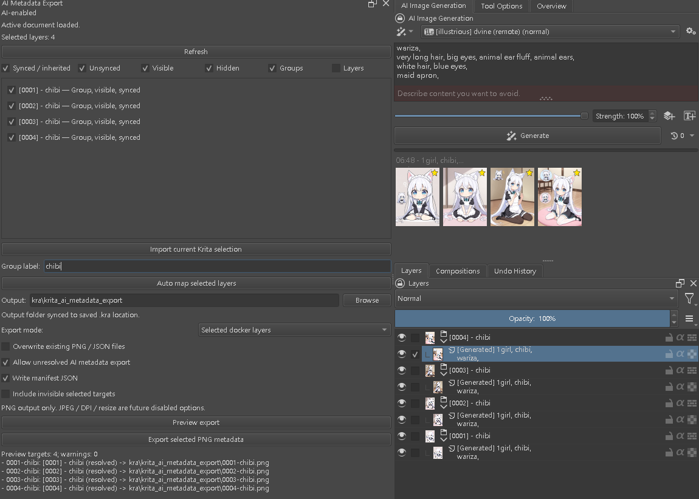
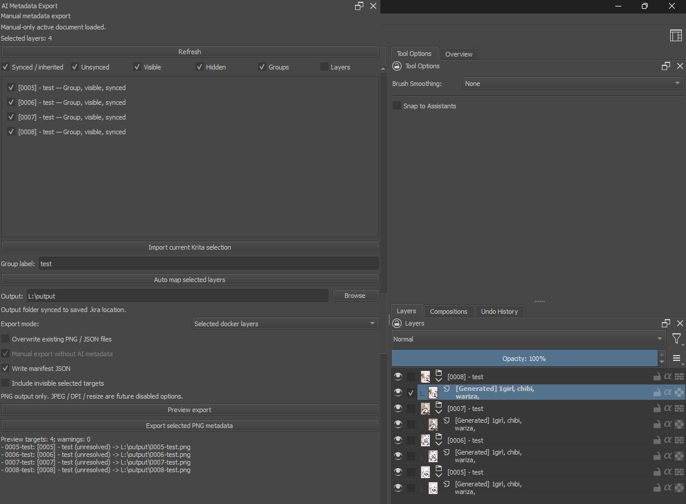
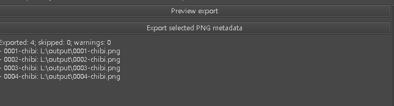
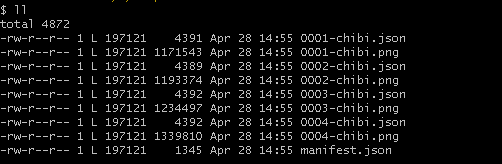

# Krita AI Metadata Export

**Version:** 0.20  
**License:** MIT

Krita AI Metadata Export は、Krita のレイヤーや export group を PNG として書き出し、対応する JSON sidecar と任意の batch manifest を生成するための Krita プラグインです。

0.20 では Krita 5 / Krita 6 対応の docker workflow と、Krita AI Diffusion に依存しない manual metadata export mode を追加しました。Krita AI Diffusion が利用できる場合は AI 生成 prompt metadata を読み取れますが、インストールされていない環境でも grouping、preview、PNG export、JSON sidecar、manifest の基本 workflow は使用できます。

## 0.20 の主な変更点

- Krita 5 / Krita 6 互換の plugin registration と docker support
- Krita AI Diffusion なしで動作する manual metadata export mode
- 選択レイヤーまたは export group から PNG と JSON sidecar を出力
- `0001-chibi` のような読みやすい連番 export key
- 選択された生成レイヤー向けの auto map workflow
- `.kra` document 内への metadata mapping 保存
- resolved / unresolved export target を確認する preview panel
- batch `manifest.json` support
- レイヤー移動、古い group 削除、再 auto map 後の安定性を改善
- stale group record が古い seed を再利用する可能性を修正
- manual mode で不要な Krita AI unavailable warning を表示しないように変更

## このプラグインの目的

このプラグインは、Krita document 内の生成レイヤーを編集、整理、group 化、rename、公開準備した後でも、export される画像と対応 metadata の関係を維持するためのものです。

次のような用途に向いています。

- 選択した生成レイヤーを PNG として export
- 各 PNG に対応する JSON metadata を保存
- batch export に安定した filename を使用
- Krita AI Diffusion metadata が利用できる場合は generation parameters を保持
- Krita AI Diffusion が利用できない場合でも手動整理した artwork を export
- ファイルを書き出す前に output を preview

## Requirements

### Required

- Python plugin support が有効な Krita
- 書き込み可能な output folder

### Optional

- Krita AI Diffusion

Krita AI Diffusion は AI prompt と generation metadata を読み取る場合にのみ必要です。Manual grouping と基本的な PNG / JSON export は Krita AI Diffusion に依存しません。

## Installation

1. この repository を download または clone します。
2. Plugin folder を Krita の Python plugin directory にコピーします。
3. Krita を再起動します。
4. Krita の Python Plugin Manager で plugin を有効化します。
5. Krita の Docker menu から Metadata Export docker を開きます。

## Basic Workflow

### 1. Metadata Export docker を開く

Docker には次の項目があります。

- Runtime mode label
- 現在の document state
- Layer selection controls
- Layer list と metadata sync state
- Manual group label input
- Output folder selection
- Export options
- Preview log
- Export result log

### 2. AI-enabled mode または manual mode を使う

Krita AI Diffusion metadata が利用できる場合、plugin は metadata snapshot または job history から prompt metadata を解決できます。

Krita AI Diffusion が利用できない場合、plugin は manual metadata export mode を使用します。

Manual mode でも次の workflow は使用できます。

- Layers または groups を選択
- Export groups を作成
- Export targets を preview
- PNG files を export
- JSON sidecars を書き出し
- Manifest を書き出し

Manual mode は存在しない prompt、seed、sampler、model data を勝手に作成しません。

### 3. Layers を filter して選択する

Layer list filters で表示対象を絞り込めます。

- Synced / inherited
- Unsynced
- Visible
- Hidden
- Groups
- Layers

現在の Krita selection を plugin selection に取り込み、mapping または export する layers を選択できます。

### 4. Group label を入力する

選択 layers を mapping する前に、読みやすい group label を入力します。

例：

~~~text
chibi
~~~

Plugin は export 向けの名前を作成します。

~~~text
[0001] - chibi
0001-chibi.png
0001-chibi.json
~~~

複数 layers を選択した場合、連番 target が作成されます。

~~~text
0001-chibi.png
0002-chibi.png
0003-chibi.png
0004-chibi.png
~~~

Seed は利用可能な場合 metadata に保存されますが、group name や filename には使用されません。

### 5. Auto map selected layers

**Auto map selected layers** をクリックします。

Auto mapping は metadata export group を作成し、その mapping を `.kra` document に保存します。

これにより、あとで layers を整理した場合でも、document 内に保存された snapshot から metadata を解決できます。

0.20 では、layer を古い group から移動し、古い group を削除してから再度 auto map したときに、古い group の seed が再利用される可能性がある問題も修正しています。

### 6. Output folder を選択する

現在の document が保存済みの場合、output folder は `.kra` の場所に合わせられます。

Document が未保存の場合、plugin は次のような home export folder を使用できます。

~~~text
~/krita_ai_metadata_export
~~~

**Browse** から手動で folder を選択することもできます。

### 7. Export options を設定する

主な options は次の通りです。

- Export mode
- Overwrite existing files
- Allow unresolved export
- Write manifest
- Include invisible selected targets

この version の主な export format は PNG です。

### 8. Preview export

ファイルを書き出す前に **Preview export** をクリックします。

Preview では次を確認できます。

- Target count
- Output paths
- Resolved / unresolved metadata state
- Warnings
- Export key が正しいかどうか

例：

~~~text
Preview targets: 2; warnings: 0
- 0005-test: [Generated] ... (resolved) -> output/0005-test.png
- 0006-test: [Generated] ... (resolved) -> output/0006-test.png
~~~

### 9. Export selected PNG metadata

**Export selected PNG metadata** をクリックします。

各 export target について、次の files が書き出されます。

~~~text
{name}.png
{name}.json
~~~

Manifest が有効な場合は、次も書き出されます。

~~~text
manifest.json
~~~

## Output Files

### PNG

PNG は実際に export される画像です。

Metadata が利用できる場合、PNG に generation parameters を埋め込めます。

### JSON sidecar

JSON sidecar には structured export payload が保存されます。

- Export key
- Group name
- Group ID
- Layer IDs
- Manual label
- Sync index
- Image index
- 利用可能な seed
- 利用可能な params snapshot
- 利用可能な A1111 parameters
- Runtime mode fields
- Warning list
- Group target の child layer summary

### Manifest

任意の `manifest.json` は batch-level の export index です。

## Metadata and Manual Mode

AI-enabled mode では、保存された metadata snapshot と Krita AI Diffusion integration を使って generation metadata を書き出せます。

Manual mode では、prompt search と AI metadata lookup は無効になります。Export は引き続き可能ですが、plugin が存在しない prompt や seed を作成することはありません。

これにより、output は正確に保たれます。

- 利用可能な metadata は保存される
- 不足している metadata は不足したまま扱う
- Manual export は引き続き使用できる
- PNG / JSON / manifest files は生成できる

## Civitai Create Post Verification

Export した PNG は Civitai の create post 画面に upload できます。

Generation metadata が利用できる場合、Civitai は PNG に埋め込まれた parameters を読み取り、prompt、negative prompt、preview image、seed、steps、sampler、guidance などの generation settings を表示できます。

これは、export された PNG が外部 tools で解析可能な metadata を保持しているか確認するために役立ちます。

## Recommended Use

- Export 前に **Preview export** を使用してください。
- Auto map 後に `.kra` を保存し、metadata mapping を保持してください。
- File names には読みやすい group label を使用してください。
- Batch export では **Write manifest** を有効にしてください。
- Metadata が不完全な output を意図する場合のみ **Allow unresolved export** を使用してください。

## License

This project is licensed under the MIT License.

## Links

- Krita: https://krita.org/
- Krita GitHub: https://github.com/KDE/krita
- Krita AI Diffusion: https://github.com/Acly/krita-ai-diffusion