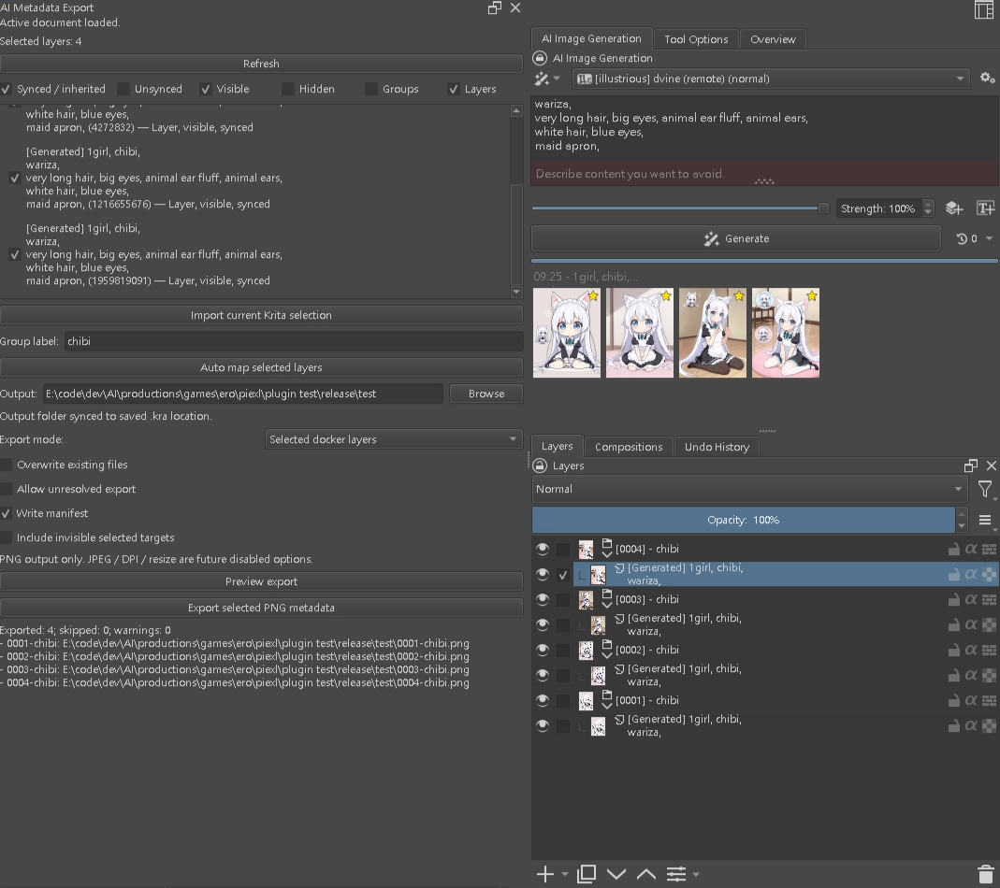
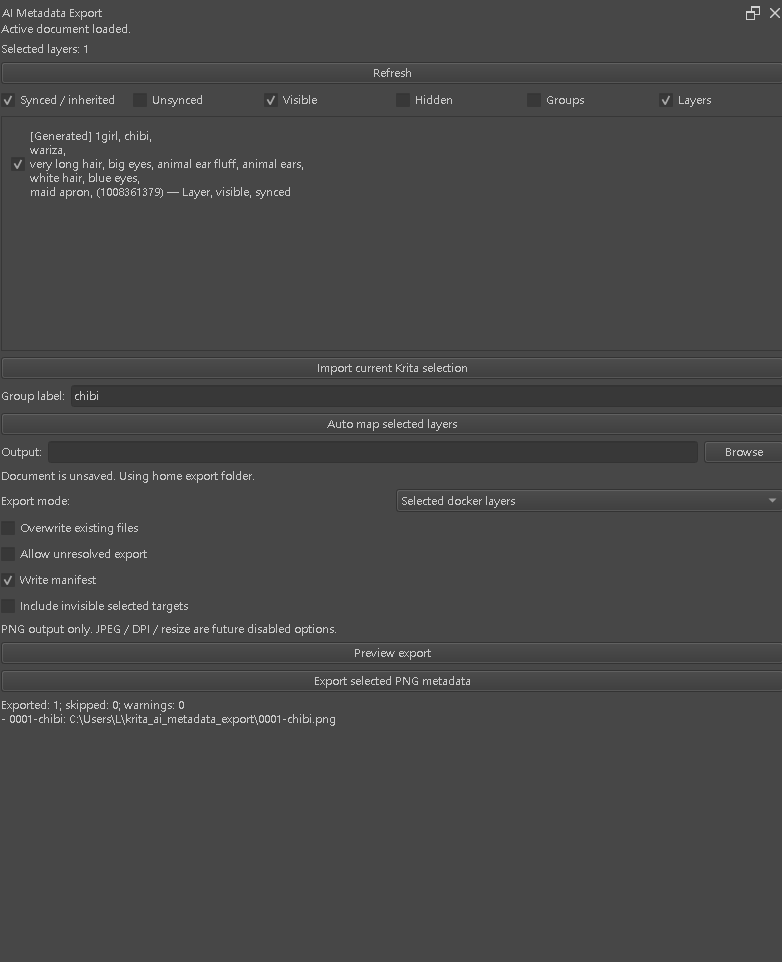
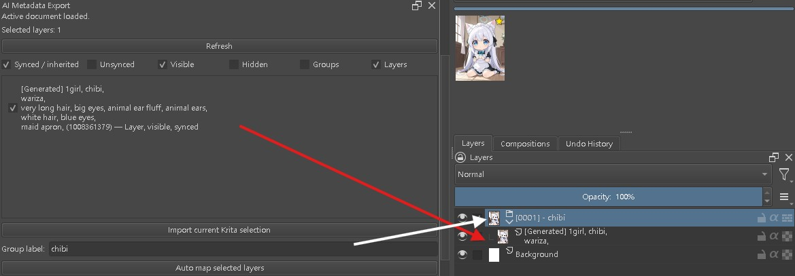
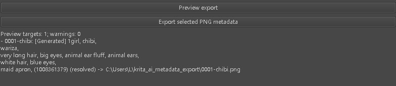
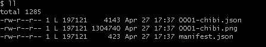
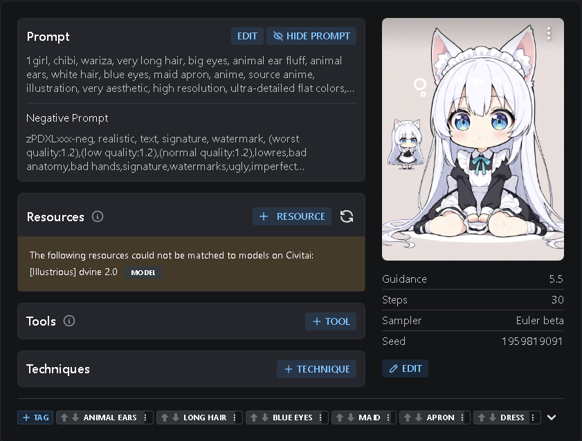

# Krita AI Metadata Export

Krita AI Metadata Export is a Krita plugin for exporting Krita AI Diffusion results while preserving the generation metadata that belongs to each layer.

It helps artists select generated layers, create readable export groups, keep metadata mapping inside the `.kra` document, preview export targets, and export PNG files with matching JSON sidecars.

## Features

- Docker-based workflow inside Krita
- Reads generated-layer metadata from Krita AI Diffusion layers
- Supports one or multiple selected layers
- Imports the current Krita layer selection into the plugin selection
- Manual group label for export-friendly names
- Auto mapping from selected layers to metadata export groups
- Persistent metadata mapping stored in the `.kra` document
- Filters for synced / inherited, unsynced, visible, hidden, groups, and layers
- Preview panel for resolved and unresolved export targets
- PNG export with embedded generation metadata when available
- JSON sidecar export for complete metadata backup
- Optional batch `manifest.json`

## Why this plugin exists

Krita AI Diffusion can generate images and store generation information, but after layers are edited, grouped, renamed, copied, or exported later, it can be difficult to keep each visual result connected to its original generation metadata.

This plugin adds a dedicated metadata export workflow for Krita projects, so generated images can still be exported with their prompt, seed, and related metadata after the document has been organized.

## Requirements

- Krita
- Krita AI Diffusion
- Python plugin support enabled in Krita

## Installation

1. Download or clone this repository.
2. Copy the plugin folder into Krita's Python plugin directory.
3. Restart Krita.
4. Enable the plugin from Krita's Python Plugin Manager.
5. Open the docker from Krita's docker menu.

## Basic Workflow

### 1. Generate or open artwork in Krita

Use Krita AI Diffusion as usual.

Generated layers may contain prompt metadata such as:

~~~text
[Generated] 1girl, chibi,
wariza,
very long hair, big eyes, animal ear fluff, animal ears,
white hair, blue eyes,
maid apron, (1008361379)
~~~

### 2. Open the Metadata Export docker

The docker shows:

- Active document state
- Number of selected layers
- Layer metadata list
- Metadata sync state
- Group label input
- Output folder
- Export mode
- Manifest and export options
- Preview and export result logs

### 3. Select layer filters

Use the checkboxes at the top of the docker to control what appears in the layer list:

- **Synced / inherited**
- **Unsynced**
- **Visible**
- **Hidden**
- **Groups**
- **Layers**

This is useful when a document contains both generated image layers and ordinary paint or background layers.

### 4. Import the current Krita selection

Click **Import current Krita selection** to copy Krita's current layer selection into the plugin.

The docker will show the selected layer count, for example:

~~~text
Selected layers: 1
~~~

or:

~~~text
Selected layers: 4
~~~

### 5. Enter a group label

Before auto mapping selected layers, enter a human-readable group label.

Example:

~~~text
chibi
~~~

The plugin creates export-friendly names such as:

~~~text
[0001] - chibi
0001-chibi.png
0001-chibi.json
~~~

For multiple selected layers, it creates sequential targets:

~~~text
0001-chibi.png
0002-chibi.png
0003-chibi.png
0004-chibi.png
~~~

The seed is kept in metadata, but it is not used in the group name or filename.

### 6. Auto map selected layers

Click **Auto map selected layers**.

Auto mapping creates a metadata export group and stores the mapping in the `.kra` document.

After mapping, the selected generated layer appears under an export group such as:

~~~text
[0001] - chibi
  [Generated] 1girl, chibi,
  wariza,
  ...
~~~

### 7. Choose the output folder

If the document is saved, the output folder is synced to the saved `.kra` location by default.

Example:

~~~text
E:\code\dev\AI\productions\games\ero\pixel\plugin test\release\test
~~~

If the document is unsaved, the plugin uses a home export folder:

~~~text
C:\Users\L\krita_ai_metadata_export
~~~

or, in cross-platform form:

~~~text
~/krita_ai_metadata_export
~~~

You can also click **Browse** to choose a folder manually.

### 8. Choose export options

Current options include:

- **Export mode**
  - `Selected docker layers`
- **Overwrite existing files**
- **Allow unresolved export**
- **Write manifest**
- **Include invisible selected targets**

PNG output is currently the active export format. JPEG, DPI, and resize options are reserved for future use.

### 9. Preview export targets

Click **Preview export** before writing files.

The preview shows how many targets will be exported and whether there are warnings.

Example:

~~~text
Preview targets: 1; warnings: 0
- 0001-chibi: [Generated] 1girl, chibi,
wariza,
very long hair, big eyes, animal ear fluff, animal ears,
white hair, blue eyes,
maid apron, (1008361379) (resolved) -> C:\Users\L\krita_ai_metadata_export\0001-chibi.png
~~~

### 10. Export PNG metadata

Click **Export selected PNG metadata**.

For one selected target, the result may look like:

~~~text
Exported: 1; skipped: 0; warnings: 0
- 0001-chibi: C:\Users\L\krita_ai_metadata_export\0001-chibi.png
~~~

For four selected targets:

~~~text
Exported: 4; skipped: 0; warnings: 0
- 0001-chibi: E:\...\test\0001-chibi.png
- 0002-chibi: E:\...\test\0002-chibi.png
- 0003-chibi: E:\...\test\0003-chibi.png
- 0004-chibi: E:\...\test\0004-chibi.png
~~~

## Exported Files

For each resolved target, the plugin writes:

~~~text
{name}.png
{name}.json
~~~

When **Write manifest** is enabled, the plugin also writes:

~~~text
manifest.json
~~~

Example output:

~~~text
0001-chibi.json
0001-chibi.png
manifest.json
~~~

The PNG contains embedded generation metadata when available.

The JSON sidecar stores the full metadata payload for backup and external workflows.

## Civitai Create Post Verification

The exported PNG metadata can be read by Civitai's create post screen.

After uploading an exported PNG, Civitai can display the generation prompt, negative prompt, image preview, and generation parameters such as:

~~~text
Guidance: 5.5
Steps: 30
Sampler: Euler beta
Seed: 1959819091
~~~

Example prompt content shown by Civitai:

~~~text
1girl, chibi, wariza, very long hair, big eyes, animal ear fluff, animal ears,
white hair, blue eyes, maid apron, anime, source anime, illustration,
very aesthetic, high resolution, ultra-detailed flat colors, ...
~~~

Civitai may also show model/resource matching warnings if a resource name in the metadata cannot be matched to a Civitai model.

Example:

~~~text
The following resources could not be matched to models on Civitai:
[Illustrious] dvine 2.0
~~~

This confirms that the exported PNG keeps prompt metadata in a format Civitai can inspect during post creation.

## Metadata Persistence

The plugin stores export metadata mapping inside the `.kra` document.

This means exported metadata can still be resolved later, even if Krita AI Diffusion job history is deleted, as long as the `.kra` file was saved after mapping.

If no metadata snapshot exists, the target is marked unresolved. The plugin does not invent missing prompt, seed, sampler, or job data.

## Notes

- Use **Preview export** to verify target names and metadata resolution before exporting.
- Use **Write manifest** when you need a batch-level index of exported files.
- Use **Allow unresolved export** only if you intentionally want to export targets without complete metadata.
- The plugin currently focuses on PNG metadata export.

## Links

- Krita: https://krita.org/
- Krita GitHub: https://github.com/KDE/krita
- Krita AI Diffusion: https://github.com/Acly/krita-ai-diffusion